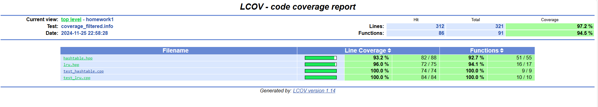

# Домашнее задание № 1

## О работе

Не очень разобрался, что в конечном счете требуется в задании.
Если при достижении максимального числа элементов в кэше все понятно, то с максимальным объемом сделал так: 
- Если новый элемент (ключ + эмбеддинг) больше максимального размера кэша - не добавляем;
- В противном случае удаляем элемент за элементом в порядке от LRU (Least recently used) до MRU (Most Recently Used), пока не освободится место под новый элемент (может быть так, что удалятся все значения для записи нового).

## Работа с проектом

Для работы с проектом нужно перейтив директорию src/main/ ветки "master".

Запуск проекта:

```bash
make
./main
```

Тестирование мапы:

```bash
make test_hashtable
```

Тестирование LRU кэша:

```bash
make test_lru
```

Общее тестирование (LRU, мапа):

```bash
make test
```

Создание отчета о покрытии кода:

```bash
make coverage
```

Результат покрытия:

Проверка кода линтером:

```bash
make lint
```

Форматирование кода в соответствии с .clang-format:

```bash
make format
```

Очистка объектных и исполняемых файлов:

```bash
make clean
```
